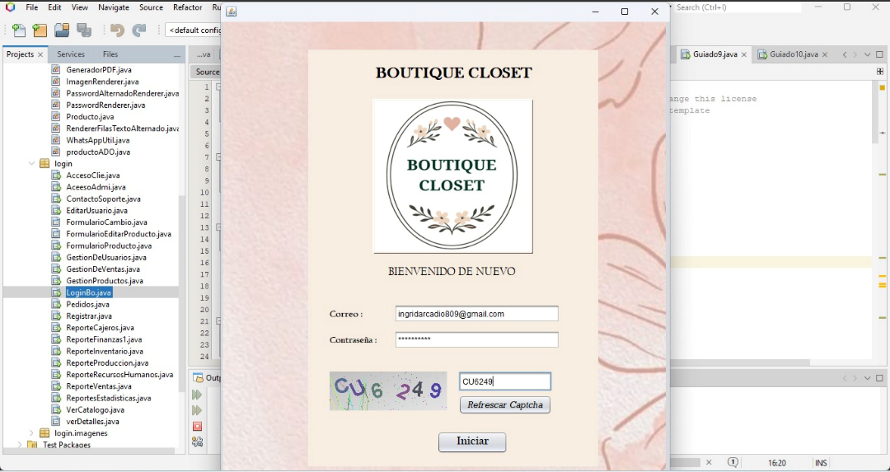
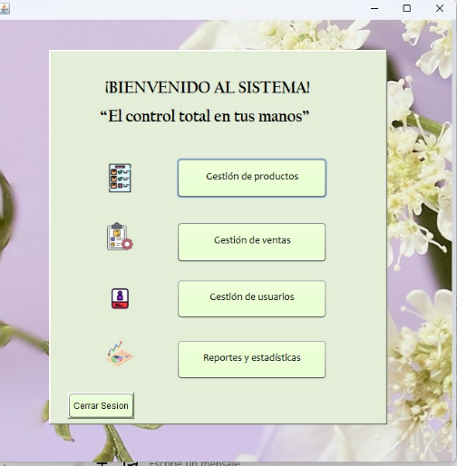
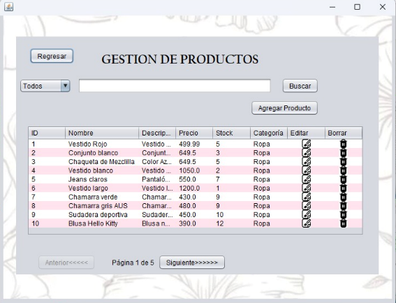
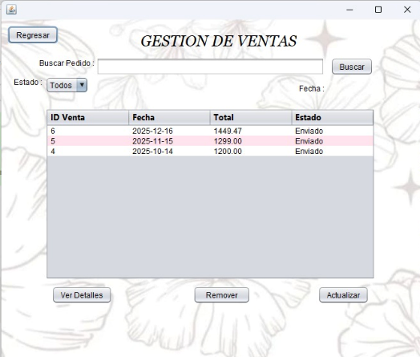
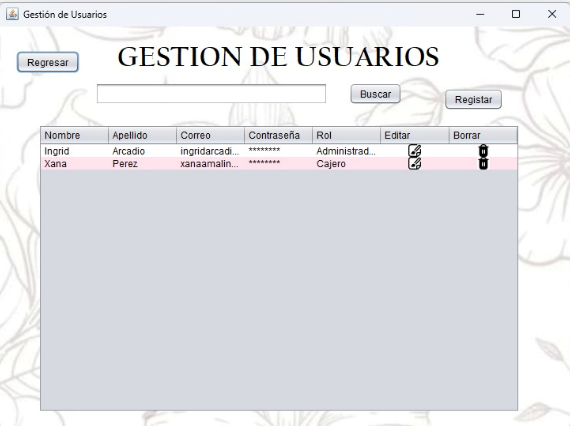
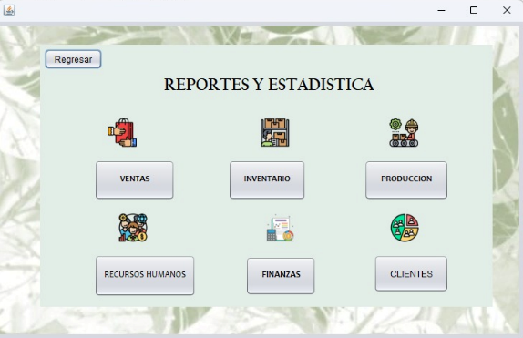
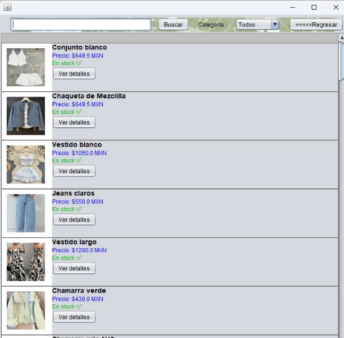
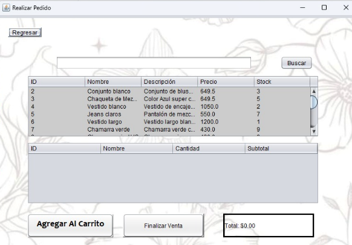
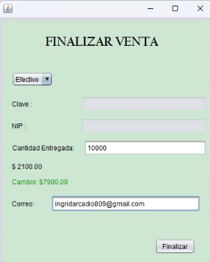
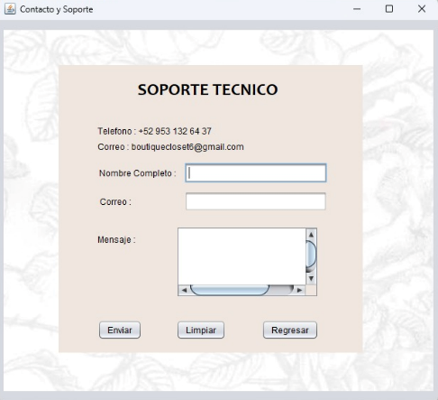

# ProyectoFinal_boutiqueCloset
# Boutique Closet - Sistema de Gestión

## Equipo: 1  
**Integrantes del equipo:**  
🔹 **Ingrid Arcadio Aparicio** – Desarrolladora y Diseñadora  
🔹 **Xana Amalinalli Pérez Jiménez** – Desarrolladora y Diseñadora  

---

## ¿Qué hace el sistema?

**"Boutique Closet"** es un sistema de escritorio que simula el funcionamiento de una boutique. El sistema permite la administración de usuarios, productos, pedidos y ventas.  
Cuenta con un inicio de sesión que valida el correo y la contraseña del usuario, e integra un sistema CAPTCHA para verificar que no se trata de un bot.  

Dependiendo del rol del usuario, el sistema habilita diferentes funcionalidades:

🔹**Administrador:** puede gestionar productos, usuarios, pedidos y consultar estadísticas. Además, puede registrar nuevos usuarios.  
🔹**Cajero:** tiene acceso a la consulta de productos y al proceso de venta.

---

## Tipo de sistema

**Aplicación de Escritorio (Desktop App)** desarrollada en **Java** utilizando **NetBeans**.  
Se conecta a una base de datos PostgreSQL y emplea diversas librerías externas para funcionalidades específicas como envío de correos, generación de PDF y gráficos.

---

## Librería externa implementada

🔹 **Librería que valida contraseñas:**  
  Es una librería reutilizada de un equipo anterior, que permite validar contraseñas durante el proceso de inicio de sesión.

  >  Archivo: `Libreria2.jar` https://github.com/Marco1120/Creacion-Libreria

🔹 **Librería que envía correos:**  
  Esta librería se encarga del envío de correos electrónicos desde el sistema al correo del usuario. Se reutilizó de un proyecto de la unidad anterior.

  >  Archivo: `Libreria3.jar` https://github.com/olmomomo/Libreria_correoElectronico

---

## Componente visual integrado

🔹 **CaptchaPanel.jar:**  
  Es un componente visual implementado en la pantalla de login, que solicita al usuario resolver un CAPTCHA antes de acceder al sistema. Este componente fue desarrollado por otro equipo en un trabajo anterior y se reutilizó para este proyecto.  
  Se usa para verificar que el acceso al sistema no sea automatizado y agregar una capa de seguridad. Ademas cuenta con un botón para recargar la imagen en caso de que la primera visalización no sea clara.
link-> https://github.com/FanyBr07/ComponenteVisual

---

## Funcionalidades clave con imágenes

---

###  Inicio de sesión con CAPTCHA
Al iniciar sesión, el usuario debe ingresar su correo y contraseña, y además resolver un CAPTCHA.  
Esto asegura que sea un usuario humano y no un acceso automatizado.

###  CRUD de usuarios
🔹 Solo accesible para el administrador.  
🔹 Permite registrar nuevos usuarios (administradores o cajeros), así como editar, eliminar o consultar la información de los existentes.

###  CRUD de productos
🔹 Permite al administrador dar de alta, modificar o eliminar productos.  
🔹 Incluye información como nombre, precio, categoría, etc.

###  CRUD de pedidos
🔹 Gestión de pedidos dentro de la boutique.  
🔹 Permite consultar el historial y detalles de cada pedido.

###  Proceso de ventas (rol cajero)
🔹 El cajero puede consultar los productos disponibles.  
🔹 Permite realizar ventas seleccionando productos y cantidades.

###  Módulo de estadísticas
🔹 Permite al administrador visualizar reportes gráficos de ventas y actividad del sistema.  
🔹 Usa gráficos generados con la librería `jfreechart`.

###  Envío de correo electrónico con PDF adjunto
🔹 Al completar ciertas acciones, como registrar usuarios o ventas, se envía un correo al usuario con un **archivo PDF** adjunto.  
🔹 El PDF puede incluir detalles del pedido o confirmaciones.  
🔹 Se usó la librería **`itextpdf-5.5.13.2.jar`** para generar el PDF y **`javax.mail`** para enviarlo por correo.  
🔹 Toda esta lógica se maneja a través de **Librería 3** (desarrollada previamente por un equipo de una unidad anterior).

---

## Dependencias y configuración

###  Librerías externas utilizadas

| Librería | Descripción |
|----------|-------------|
| `CaptchaPanel.jar` | Componente visual para verificación CAPTCHA en login |
| `Libreria2.jar` | Validación de contraseña |
| `Libreria3.jar` | Envío de correos electrónicos |
| `activation-1.1.1.jar` | Requerida para `javax.mail` |
| `javax.mail.jar` y `javax.mail-api-1.6.2.jar` | Envío de correos electrónicos |
| `itextpdf-5.5.13.2.jar` | Generación de archivos PDF |
| `jcommon-1.0.24.jar` y `jfreechart-1.5.3.jar` | Creación de gráficos y estadísticas |
| `postgresql-42.7.3.jar` | Conexión con base de datos PostgreSQL |
| `AbsoluteLayout.jar` | Permite el diseño de interfaces gráficas en NetBeans |

---

###  Pasos para instalar y ejecutar el sistema

1. Clonar el repositorio desde GitHub.
2. Abrir el proyecto en **NetBeans**.
3. Asegurarse de tener todas las librerías `.jar` añadidas en la carpeta **Libraries** del proyecto.
4. Configurar la conexión a base de datos PostgreSQL (crear la base y tablas si es necesario).
5. Ejecutar el archivo `Main.java` o el punto de entrada del sistema.

---

###  Requisitos mínimos

🔹 **Java JDK:** 24  
🔹 **NetBeans IDE:** 12 o superior  
🔹 **Base de datos:** PostgreSQL 13 o superior  
🔹 **Sistema operativo:** Windows (probado en entorno Windows)

---

 **Gracias por revisar nuestro proyecto "Boutique Closet"**  
Desarrollado con dedicación y trabajo en equipo por el Equipo 1.

